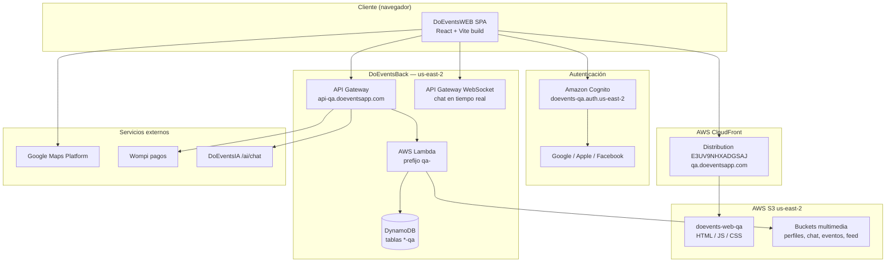
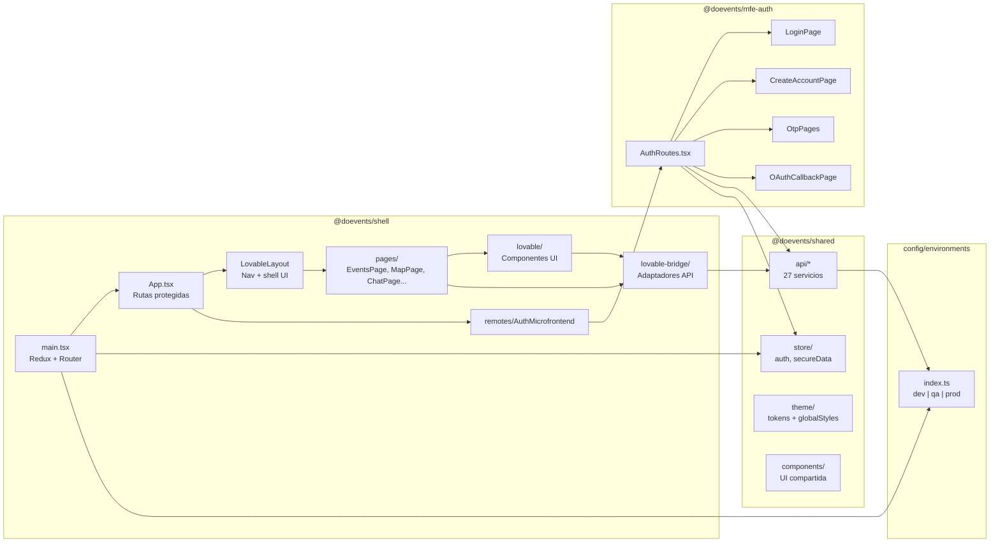
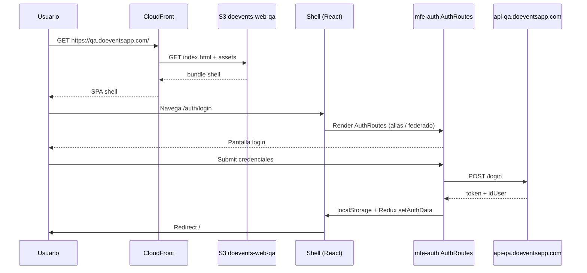
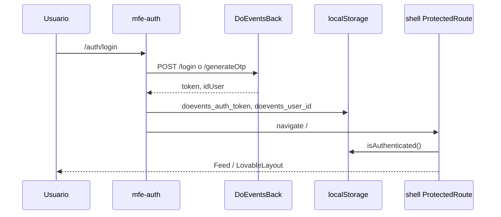
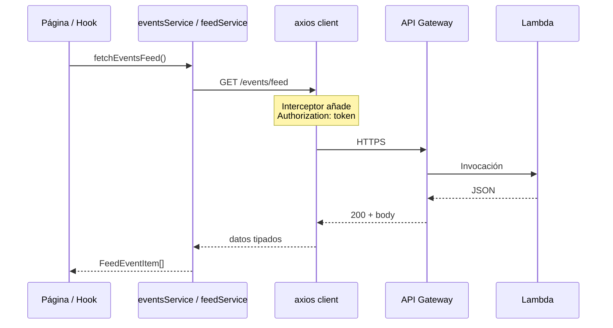
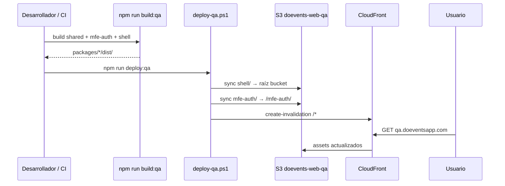
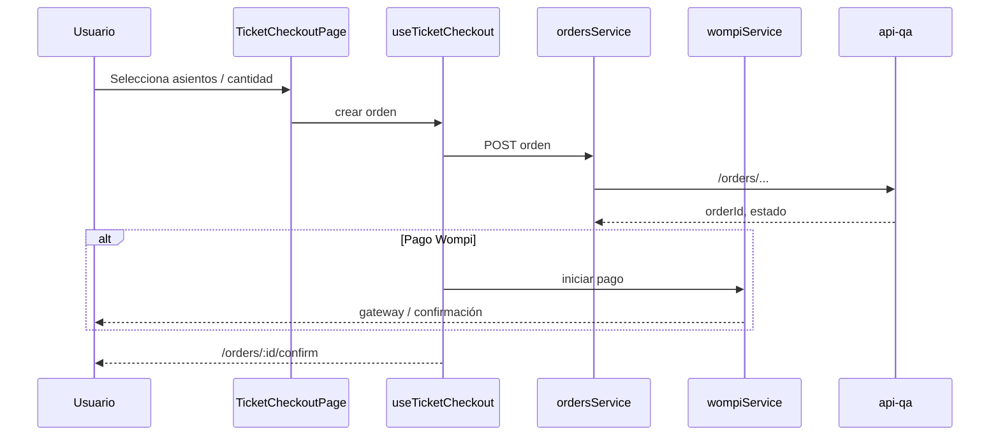
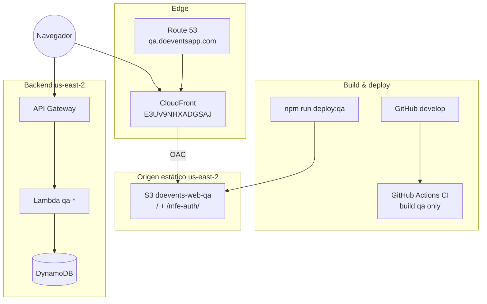

# DoEventsWEB — Documentación técnica

Aplicación web de **Do.Events** para gestión de eventos, lugares, servicios, tickets, chat y pagos. Migrada desde **DoEventsFront** (React Native / Expo) hacia **React 18 + TypeScript + Vite**, con UI portada desde **Lovable** y backend en **DoEventsBack** (AWS).

**Repositorio:** [github.com/doeventsrepo/DoEventsWEB](https://github.com/doeventsrepo/DoEventsWEB) · Rama principal de trabajo: `develop`

---

## Tabla de contenidos

1. [Estrategia de desarrollo](#1-estrategia-de-desarrollo)
2. [Stack tecnológico](#2-stack-tecnológico)
3. [Arquitectura general](#3-arquitectura-general)
4. [Diagrama de componentes](#4-diagrama-de-componentes)
5. [Microfrontends y Module Federation](#5-microfrontends-y-module-federation)
6. [Diagramas de secuencia](#6-diagramas-de-secuencia)
7. [Estructura del monorepo](#7-estructura-del-monorepo)
8. [Configuración de entornos](#8-configuración-de-entornos)
9. [Despliegue en AWS](#9-despliegue-en-aws)
10. [CI/CD y build](#10-cicd-y-build)
11. [Desarrollo local](#11-desarrollo-local)
12. [Repositorios relacionados](#12-repositorios-relacionados)

---

## 1. Estrategia de desarrollo

### 1.1 Principios

| Principio | Descripción |
|-----------|-------------|
| **Migración incremental** | Se migró desde DoEventsFront por fases (auth → eventos → chat → resto), reutilizando lógica de negocio y contratos API. |
| **Monorepo npm workspaces** | Un solo repositorio con paquetes `@doevents/shared`, `@doevents/shell` y `@doevents/mfe-auth`. |
| **Microfrontends lógicos** | Auth separado en `mfe-auth`; el shell orquesta rutas y layout. Preparado para federación remota. |
| **Lovable como referencia UI** | Componentes visuales en `packages/shell/src/lovable/`; la integración real vive en `lovable-bridge/` (adaptadores a API). |
| **Backend como fuente de verdad** | Sin mocks en runtime: datos vía `api-qa.doeventsapp.com` y servicios en `@doevents/shared`. |
| **Config centralizada** | URLs, endpoints y feature flags en `config/environments/index.ts` + variables `VITE_*`. |
| **SPA estática en AWS** | Build Vite → S3 + CloudFront; sin servidor Node en producción. |

### 1.2 Patrón de integración Lovable

```text
Lovable (diseño UX)
    → packages/shell/src/lovable/     (componentes UI)
    → packages/shell/src/lovable-bridge/ (adaptadores: API, tipos, hooks)
    → @doevents/shared/api              (clientes HTTP)
    → DoEventsBack (Lambdas + DynamoDB)
```

Los adaptadores (`feedAdapter`, `mapAdapter`, `guestsAdapter`, `statsAdapter`, etc.) traducen respuestas del backend al formato que esperan los componentes Lovable.

### 1.3 Por qué React web (y no Flutter nativo en esta fase)

- Compatibilidad directa con el código y conocimiento de **DoEventsFront**.
- Reutilización de **Redux**, **axios** y tipos TypeScript.
- Despliegue simple como sitio estático (S3/CloudFront).
- Ruta futura a móvil: **Capacitor** (empaquetar el build web) o app Expo existente (**DoEventsFront**).

---

## 2. Stack tecnológico

### 2.1 Runtime y build

| Capa | Tecnología | Versión / notas |
|------|------------|-----------------|
| Lenguaje | **TypeScript** | 5.7.x |
| Runtime dev | **Node.js** | ≥ 20 |
| UI | **React** | 18.3 |
| Bundler | **Vite** | 6.x |
| Enrutamiento | **React Router** | 7.x |
| Estado global | **Redux Toolkit** | 2.x |
| HTTP | **axios** | Interceptores + token en `Authorization` |
| Estilos | **Tailwind CSS** + tokens | Radix UI, `class-variance-authority` |
| Microfrontends | **@module-federation/vite** | Singletons: react, react-dom, router, redux, axios |
| Formularios | **react-hook-form** + **zod** | Validación en wizards de eventos/lugares |
| Mapas | **Google Maps JavaScript API** | `VITE_GOOGLE_MAPS_API_KEY` |
| Pagos | **Wompi** | vía `wompiService` |
| Gráficos / export | **recharts**, **xlsx** | Estadísticas y exportación Excel |
| CI | **GitHub Actions** | `npm ci` + `build:qa` en push/PR |

### 2.2 Paquetes del monorepo

| Paquete | Nombre npm | Responsabilidad |
|---------|------------|-----------------|
| `packages/shared` | `@doevents/shared` | API clients, Redux store, tema, componentes compartidos, utilidades |
| `packages/shell` | `@doevents/shell` | App host: rutas, layout, feed, mapa, perfil, eventos, admin |
| `packages/mfe-auth` | `@doevents/mfe-auth` | Login, registro, OTP, OAuth, gustos, recuperación de contraseña |

---

## 3. Arquitectura general

DoEventsWEB es una **SPA** que se sirve desde **CloudFront**. Consume APIs REST y WebSocket del backend **DoEventsBack**. Los archivos multimedia van a buckets S3 dedicados.



### 3.1 Regiones AWS

| Recurso | QA | Producción (config) |
|---------|-----|---------------------|
| Hosting web (S3/CF origen) | `us-east-2` | `us-east-1` (previsto) |
| API + Lambdas + DynamoDB | `us-east-2` | `us-east-1` |
| Certificado ACM (CloudFront) | `us-east-1` | `us-east-1` (requisito global de CF) |

---

## 4. Diagrama de componentes



### 4.1 Capas dentro del shell

| Capa | Ruta | Rol |
|------|------|-----|
| **Páginas** | `src/pages/` | Contenedores por ruta; conectan bridge + lovable |
| **UI Lovable** | `src/lovable/` | Componentes visuales (feed, eventos, mapa, tickets…) |
| **Bridge** | `src/lovable-bridge/` | Mapeo API ↔ tipos Lovable, hooks (`useApiGuests`, `useTicketCheckout`) |
| **Remotes** | `src/remotes/` | Punto de entrada del microfrontend auth |

---

## 5. Microfrontends y Module Federation

### 5.1 Modelo actual

- **`mfe-auth`** expone `AuthRoutes` y `AuthApp` vía Module Federation (`remoteEntry.js`).
- **`shell`** importa auth por alias de código fuente en desarrollo/build:

```ts
'@mfe-auth/AuthRoutes': '../mfe-auth/src/AuthRoutes.tsx'
```

- Dependencias compartidas como **singleton** evitan duplicar React/Redux.

### 5.2 Despliegue de artefactos

| Ruta en QA | Origen build | Contenido |
|------------|--------------|-----------|
| `/` | `packages/shell/dist/` | App principal |
| `/mfe-auth/*` | `packages/mfe-auth/dist/` | Chunks + `remoteEntry.js` |

### 5.3 Diagrama de carga



---

## 6. Diagramas de secuencia

### 6.1 Login con teléfono / OTP



### 6.2 Petición autenticada al backend



### 6.3 Flujo de despliegue QA



### 6.4 Compra de ticket (simplificado)



---

## 7. Estructura del monorepo

```text
DoEventsWEB/
├── config/environments/          # dev | qa | prod — URLs y endpoints
├── packages/
│   ├── shared/
│   │   └── src/
│   │       ├── api/              # Clientes REST (auth, events, chat, wompi…)
│   │       ├── store/            # Redux: auth, secureData
│   │       ├── theme/            # Design tokens + globalStyles
│   │       ├── components/       # UI compartida (Button, EventCard, CreatePostSheet…)
│   │       └── lib/              # Cachés, imágenes, geocoding, errores API
│   ├── shell/
│   │   └── src/
│   │       ├── main.tsx          # Bootstrap app
│   │       ├── App.tsx           # Router principal
│   │       ├── pages/            # Una página por feature/ruta
│   │       ├── lovable/          # UI portada desde Lovable
│   │       ├── lovable-bridge/   # Adaptadores e integración backend
│   │       └── remotes/          # AuthMicrofrontend
│   └── mfe-auth/
│       └── src/
│           ├── AuthRoutes.tsx
│           └── pages/            # Login, registro, OTP, OAuth…
├── infrastructure/aws/           # deploy-qa.ps1, qa-state.json, scripts seed
├── .github/workflows/ci.yml      # Build en PR/push
├── .env.example                  # Plantilla variables VITE_*
└── package.json                  # Workspaces + scripts
```

### 7.1 Servicios API en `@doevents/shared`

`authService`, `eventsService`, `feedService`, `ordersService`, `ticketsService`, `chatService`, `notificationsService`, `venueService`, `guestsService`, `wompiService`, `adminService`, `aiAssistantService`, entre otros (ver `packages/shared/src/api/index.ts`).

---

## 8. Configuración de entornos

Archivo único: `config/environments/index.ts`. Se activa con `VITE_DOEVENTS_ENV` o modo Vite `qa`.

| Entorno | Variable | API | Web | WebSocket chat |
|---------|----------|-----|-----|----------------|
| Desarrollo | `dev` (default local) | `api-qa.doeventsapp.com` | localhost:5173 | `wss://zjg66jel41.execute-api.us-east-2.amazonaws.com/qa` |
| QA | `qa` | `https://api-qa.doeventsapp.com` | `https://qa.doeventsapp.com` | mismo WS QA |
| Producción | `prod` | `https://api.doeventsapp.com` | `https://doeventsapp.com` | `wss://ws.doeventsapp.com` |

### 8.1 Variables de entorno (`.env.qa` / `.env.local`)

| Variable | Uso |
|----------|-----|
| `VITE_DOEVENTS_ENV` | `dev` \| `qa` \| `prod` |
| `VITE_GOOGLE_MAPS_API_KEY` | Mapa y geocoding en navegador |
| `VITE_GOOGLE_CLIENT_ID` | OAuth Google |
| `VITE_COGNITO_*` | User pool, client, domain |
| `VITE_FACEBOOK_APP_ID` / `VITE_APPLE_CLIENT_ID` | OAuth opcional |

> `.env.qa` está en `.gitignore`. En CI/CodeBuild las variables deben inyectarse en el entorno de build.

### 8.2 Sesión en cliente

| Clave | Contenido |
|-------|-----------|
| `doevents_auth_token` | Token JWT / sesión API |
| `doevents_user_id` | ID usuario |
| `doevents_secure_email` / `doevents_secure_phone` | Datos de enrolamiento |

---

## 9. Despliegue en AWS

### 9.1 Resumen QA (estado documentado)

Fuente: `infrastructure/aws/qa-state.json`

| Recurso | Valor |
|---------|-------|
| **Dominio** | https://qa.doeventsapp.com |
| **Login** | https://qa.doeventsapp.com/auth/login |
| **Bucket S3** | `doevents-web-qa` (`us-east-2`) |
| **CloudFront ID** | `E3UV9NHXADGSAJ` |
| **CloudFront domain** | `d2u3uwg4xpaxra.cloudfront.net` |
| **OAC ID** | `E3TV58WYA0XY9A` |
| **Certificado ACM** | `us-east-1` (ARN en `qa-state.json`) |
| **API backend** | `https://api-qa.doeventsapp.com` |
| **Cognito** | `doevents-qa.auth.us-east-2.amazoncognito.com` |

### 9.2 Pipeline de despliegue manual

```powershell
cd DoEventsWEB
npm install
npm run build:qa          # Compila shared + mfe-auth + shell (modo qa)
npm run deploy:qa         # Ejecuta infrastructure/aws/deploy-qa.ps1
```

El script `deploy-qa.ps1`:

1. Ejecuta `npm run build:qa`
2. `aws s3 sync packages/shell/dist/` → `s3://doevents-web-qa/`
3. `aws s3 sync packages/mfe-auth/dist/` → `s3://doevents-web-qa/mfe-auth/`
4. Invalida CloudFront `/*`

**Requisitos:** AWS CLI configurado con permisos sobre el bucket y la distribución.

### 9.3 Seguridad del bucket

- El bucket **no es público** directamente.
- **Origin Access Control (OAC)** permite solo a CloudFront leer objetos (`s3-bucket-policy.json`).
- SPA routing: errores 403/404 de CloudFront devuelven `/index.html` (200).

### 9.4 Backend y datos (DoEventsBack — no en este repo)

| Componente | QA |
|------------|-----|
| API Gateway | `api-qa.doeventsapp.com` |
| Lambdas | Prefijo `qa-aws-lambda-*` |
| DynamoDB | Tablas con sufijo `-qa` |
| S3 multimedia | `doevents-profile-media-qa`, `doeventschatroombucket`, `doevent-feed-media`, etc. |

### 9.5 Diagrama de despliegue AWS



---

## 10. CI/CD y build

### 10.1 GitHub Actions (`.github/workflows/ci.yml`)

| Trigger | `push` / `pull_request` en `develop` y `main` |
| Jobs | `npm ci` → `npm run build:qa` → `npm run lint` |
| Deploy automático | **No** — el deploy a QA es manual vía `deploy:qa` |

### 10.2 Scripts npm (raíz)

| Script | Acción |
|--------|--------|
| `npm run dev` | Shell en `:5173` |
| `npm run dev:auth` | mfe-auth en `:5001` |
| `npm run dev:all` | Ambos en paralelo (`concurrently`) |
| `npm run build` | Build producción |
| `npm run build:qa` | Build con modo `qa` (Vite `--mode qa`) |
| `npm run deploy:qa` | Build + sync S3 + invalidación CF |
| `npm run preview` | Preview del build shell |

---

## 11. Desarrollo local

Guía ampliada: **[DESARROLLO.md](./DESARROLLO.md)**

```powershell
git clone https://github.com/doeventsrepo/DoEventsWEB.git
cd DoEventsWEB
git checkout develop
npm install
copy .env.example .env.local   # Ajustar VITE_GOOGLE_MAPS_API_KEY, etc.
npm run dev:all
```

| Servicio | URL |
|----------|-----|
| Shell | http://localhost:5173 |
| Login | http://localhost:5173/auth/login |
| mfe-auth (remoto dev) | http://localhost:5001 |

Por defecto, el entorno `dev` apunta a **API QA** para tener datos reales de prueba.

---

## 12. Repositorios relacionados

| Repositorio | Rol |
|-------------|-----|
| **[DoEventsWEB](https://github.com/doeventsrepo/DoEventsWEB)** | Este frontend (SPA) |
| **[DoEventsBack](https://github.com/doeventsrepo/DoEventsBack)** | Lambdas, API Gateway, DynamoDB, reglas de negocio |
| **[DoEventsIA](https://github.com/doeventsrepo/DoEventsIA)** | Asistente IA — endpoint `/ai/chat` |
| **[discover-joyful-feed](https://github.com/doeventsrepo/discover-joyful-feed)** | Diseño UX Lovable — no es fuente de datos en runtime |
| **DoEventsFront** | App móvil histórica (Expo / React Native) |

---

## Referencias rápidas

- Desarrollo local: [DESARROLLO.md](./DESARROLLO.md)
- Scripts AWS QA: [infrastructure/aws/README.md](./infrastructure/aws/README.md)
- OAuth / Cognito: [infrastructure/oauth/OAUTH_SETUP.md](./infrastructure/oauth/OAUTH_SETUP.md)
- Estado QA CloudFront/S3: [infrastructure/aws/qa-state.json](./infrastructure/aws/qa-state.json)

---

*Última actualización de arquitectura: alineada con rama `develop` — monorepo React/Vite, deploy S3+CloudFront en `qa.doeventsapp.com`.*
